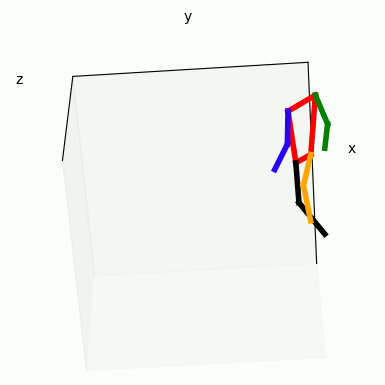
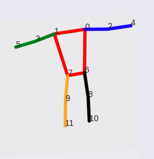

**Real time 3D body pose estimation using MediaPipe**

This is a demo on how to obtain 3D coordinates of body keypoints using MediaPipe and two calibrated cameras. Two cameras are required as there is no way to obtain global 3D coordinates from a single camera. For camera calibration, my package on github [stereo calibrate](https://github.com/TemugeB/python_stereo_camera_calibrate), my blog post on how to stereo calibrate two cameras: [link](https://temugeb.github.io/opencv/python/2021/02/02/stereo-camera-calibration-and-triangulation.html). Alternatively, follow the camera calibration at Opencv documentations: [link](https://docs.opencv.org/3.4/d9/d0c/group__calib3d.html). If you want to know some details on how this code works, take a look at my accompanying blog post here: [link](https://temugeb.github.io/python/computer_vision/2021/06/27/handpose3d.html).

  


**MediaPipe**  
Install mediapipe in your virtual environment using:
```
pip install mediapipe
```

**Requirements**  
```
Mediapipe
Python3.8
Opencv
matplotlib
```

**Usage: Getting real time 3D coordinates**  
As a demo, I've included two short video clips and corresponding camera calibration parameters. Simply run as:
```
python bodypose3d.py
```
If you want to use webcam, call the program with camera ids. For example, cameras registered to 0 and 1:
```
python bodypose3d.py 0 1
```
Make sure the corresponding camera parameters are also updated for your cameras in ```camera_parameters``` folder. My cameras were calibrated to 720px720p. The code crops the input image to this size. If your cameras are calibrated to a different resolution, make sure to change the code to your camera calibration. Also, if your cameras are different aspect ratios (i.e. 16:10, 16:9 etc), then remove the cropping calls in the code. Mediapipe crops your images and resizes them so it doesn't care if youre cameras are calibrated to 1080p, 720p or any other resolution. 

The 3D coordinate in each video frame is recorded in ```frame_p3ds``` parameter. Use this for real time application. The keypoints are indexed as below image. More keypoints can be added by including their ids at the top of the file. If keypoints are not found, then the keypoints are recorded as (-1, -1, -1). **Warning**: The code also saves keypoints for all previous frames. If you run the code for long periods, then you will run out of memory. To fix this, remove append calls to: ```kpts_3d, kpts_cam0. kpts_cam1```. When you press the ESC key, body keypoints detection will stop and three files will be saved to disk. These contain recorded 2D and 3D coordinates. 



**Usage: Viewing 3D coordinates**  
The ```bodypose3d.py``` program creates a 3D coordinates file: ```kpts_3d.dat```. To view the recorded 3D coordinates, simply call:
```
python show_3d_pose.py
```
